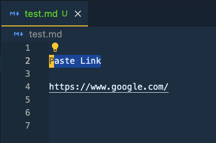
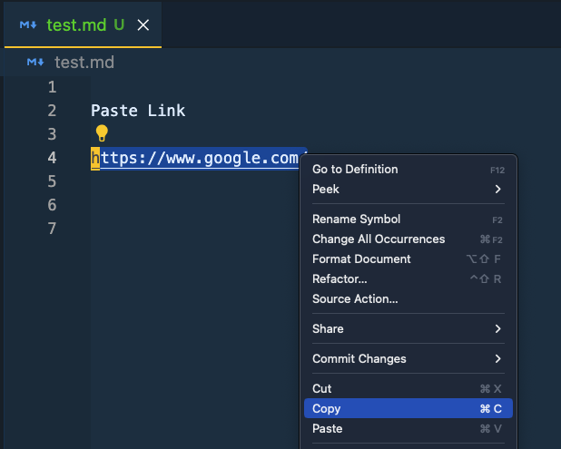
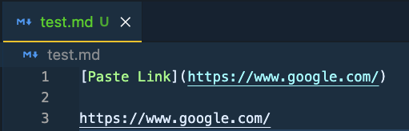

# Paste URL to Markdown

## Features

This extension is for easier to paste the url link on selected text in markdown file.

## Usage

- select the text
  
- copy the url
  
- hit `ctrl+cmd+p`
  

You can change the default shortcut to whatever you like by editing the `Code > Preferences > Keyboard Shortcuts` (`File > Preferences > Keyboard Shortcuts on Windows`):

```json
[{ "key": "ctrl+alt+p", "command": "paste-url-md.pasteUrl" }]
```

## Following extension guidelines

Ensure that you've read through the extensions guidelines and follow the best practices for creating your extension.

- [Extension Guidelines](https://code.visualstudio.com/api/references/extension-guidelines)

## Publish

- add `repository` in `package.json`

```json
{
  "repository": {
    "type": "git",
    "url": "https://github.com/npm/cli.git"
  }
}
```

- add file `LICENSE`

- https://code.visualstudio.com/api/working-with-extensions/publishing-extension

## References

- https://github.com/kukushi/PasteURL
